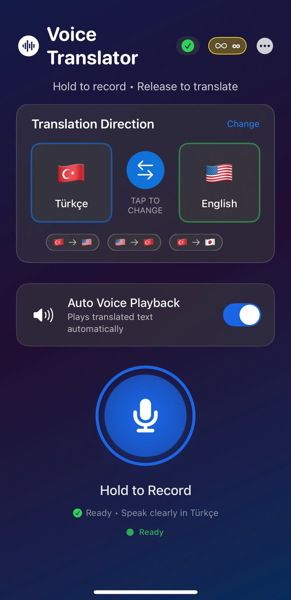
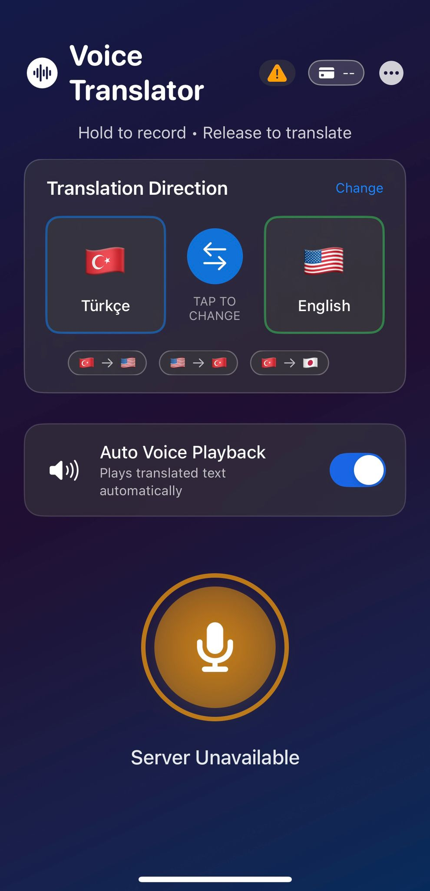
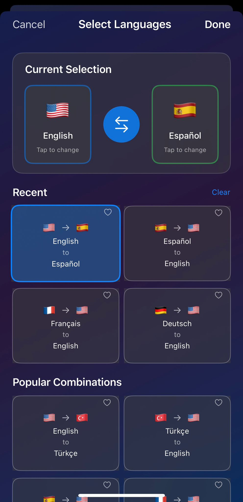
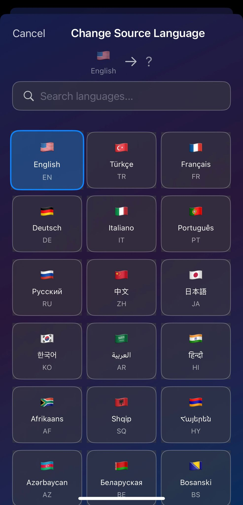
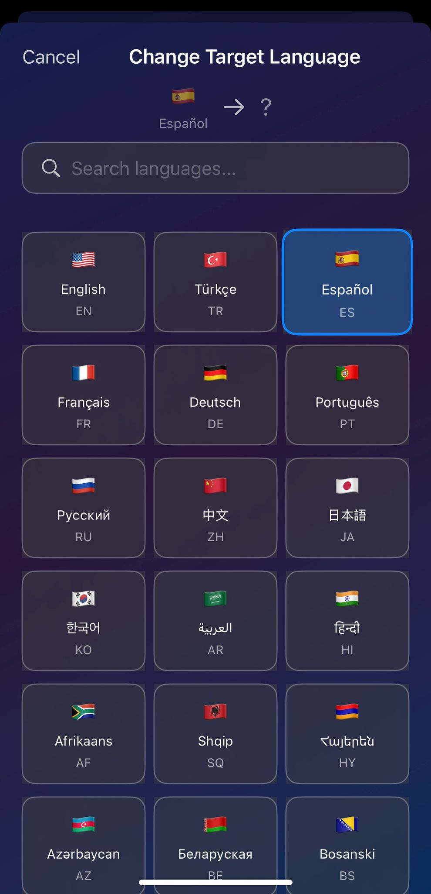

# Voice Translator iOS App

A push-to-talk voice translation app built with SwiftUI that supports 50+ languages with instant audio recording and fast translation.

## 🌟 Features

- **Push-to-Talk Recording**: Hold to record, release to translate
- **50+ Languages**: Support for major world languages
- **Fast Translation**: Quick server-side processing with AI
- **Auto Voice Playback**: Hear translations automatically
- **Offline Detection**: Smart connection monitoring
- **Premium Credits System**: Firebase-based user management
- **Drag to Cancel**: Intuitive gesture controls
- **Recording Quality Feedback**: Visual audio level indicators

## 📱 Screenshots

### Main Interface


*Clean and intuitive interface with language selection and recording button*

### Server Offline State


*Smart connection monitoring with clear offline indicators*

### Language Direction Selection


*Easy language pair selection with recent combinations*

### Source Language Selection


*Comprehensive list of 50+ supported languages*

### Target Language Selection


*Quick target language selection with search functionality*

## 🚀 Tech Stack

- **Frontend**: SwiftUI, AVFoundation
- **Backend**: Python FastAPI server
- **Authentication**: Firebase Auth
- **Database**: Firebase Firestore
- **AI**: OpenAI Whisper for speech recognition
- **Translation**: Advanced AI translation models

## 🛠 Architecture

- **NetworkManager**: Handles server communication and connection monitoring
- **VoiceRecorder**: Optimized audio recording with real-time feedback
- **LanguageManager**: Manages 50+ language pairs and recent selections
- **PremiumManager**: Handles credits and subscription logic

## 🎯 Key Features

### Push-to-Talk Interface
- Pre-configured audio session for instant recording start
- Visual feedback with recording quality indicators
- Drag up to cancel recording gesture

### Smart Connection Management
- Network monitoring with NWPathMonitor
- Server health checks only when needed (app start, background return)
- Graceful error handling with user-friendly messages

### Advanced UI/UX
- Smooth animations and haptic feedback
- Dark mode optimized design
- Real-time audio level visualization
- Auto-playback with language-specific TTS

## 📋 Requirements

- iOS 15.0+
- Xcode 14.0+
- Firebase project setup
- Backend server running

## 🚧 Setup

1. Clone the repository
2. Install dependencies via Swift Package Manager
3. Configure Firebase with your project credentials
4. Update server IP in `NetworkManager.swift`
5. Build and run

## 🔧 Configuration

Update the server endpoint in `NetworkManager.swift`:
```swift
private func getServerIP() -> String {
    return "your-server-url:8000"
}
```

## 📄 License

This project is licensed under the MIT License.